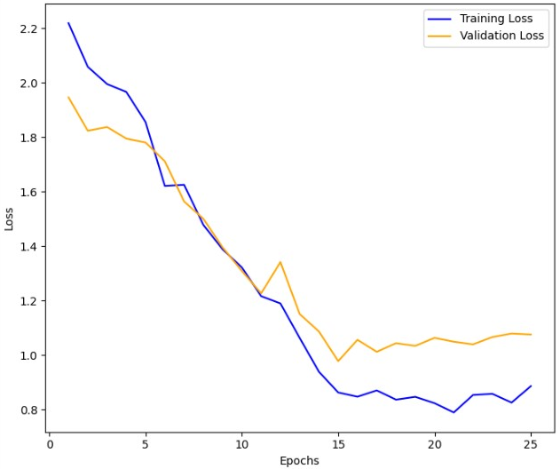
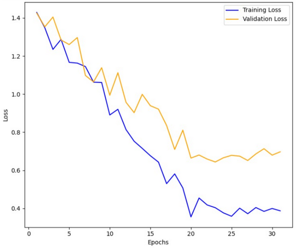

# Near duplicate images using CLIP
## Project Overview
This project focuses on Content-based Image Retrieval (CBIR) to efficiently identify near-duplicate images within a historical dataset. The goal is to leverage advanced machine learning techniques to enhance the process of retrieving visually similar images, which is crucial for various applications such as digital archiving, image similarity search, and content analysis.

## Approach
To achieve our objectives, we adopted an approach centered around CLIP (Contrastive Language-Image Pre-training), utilizing a ViT32 (Vision Transformer with a 32x32 patch size) base. 

CLIP is particularly suitable for this task as it enables cross-modal understanding between images and text, allowing us to encode images and measure their similarity based on semantic context.

## Methodologies

1.	**Zero-shot Approach**: In this method, images are encoded into feature vectors using the CLIP model. These feature vectors are then compared using cosine similarity to construct a similarity matrix. This approach does not require additional fine-tuning on specific image datasets, making it efficient for initial exploration of image similarity.
   
2.	**Fine-tuning without Data Augmentation**: Here, the CLIP model is fine-tuned on our dataset of historical images and corresponding textual captions. The fine-tuned model learns to better discriminate between visually similar images based on the specific characteristics of our dataset.
   
3.	**Fine-tuning with Data Augmentation**: Building upon the previous approach, this strategy involves augmenting the training data with various transformations such as rotations, translations, and color manipulations. Fine-tuning with augmented data aims to improve the model's robustness and generalization ability, especially in scenarios with diverse visual content.

## Our Data
### Test Data Set
The test set comprises a diverse collection of images that are visually similar.

### Training Data Set
The training dataset consists of a substantial number of historical images paired with their corresponding textual description. This pairing ensures that the model learns to associate visual features with semantic context, enhancing its ability to retrieve relevant images based on textual queries.

## Technologies 
The project is implemented using the following technologies:

1. **PyTorch:** A powerful deep learning framework used for developing and training neural network models.

2. **CLIP (Contrastive Language-Image Pre-training):** Developed by OpenAI, CLIP facilitates joint learning of image and text representations without requiring specialized architectures for each modality.

3. **Deepl:** Leveraged for translation tasks to facilitate multilingual support and understanding across diverse textual data.

## Notebooks
### 1. _Project_data_preprocessing.ipynb:_
This notebook serves as a crucial tool for preprocessing both the test and training datasets:

#### Processing the Test Dataset:
**Data Identification and Extraction:** The notebook identifies images listed in '_donnees_IS.xlsx_' and matches them with our dataset, retaining only those present in our records.

 -> **Output:** It generates '_new_IS.xlsx_' for the test dataset and organizes the identified images into the '_test_dataset_' folder. The new Excel file includes updated classifications based on our dataset's criteria.
 
#### Processing the Training Dataset:
**Data Compilation:** It systematically processes Excel files from subdirectories, standardizing column names, and extracting crucial metadata such as image captions and positions.

**Image Selection:** The notebook selectively picks images based on specified positions and naming conventions within each subdirectory.

-> **Output:** A consolidated dataframe '_df_training.xlsx_' is created, containing all pertinent information. Simultaneously, the selected training images are copied to the '_training_set_' folder.

#### Additional Features:
**Multilingual Support:** Ensures seamless translation of non-English legends into English, promoting uniformity and accessibility across datasets.

**File Generation:** Outputs meticulously curated Excel files '_new_IS.xlsx_' and '_df_training.xlsx_' that encapsulate processed data and metadata, facilitating subsequent stages of the project.

### 2. _new_set_for_test.ipynb:_
**Functionality:** Implements torchvision transforms to augment new images downloaded from internet and saves them for a visual validation later on.

### 3. _Data_Augmentation.ipynb:_
This notebook focuses on data augmentation using torchvision transforms:

**Functionality:** Implements torchvision transforms to augment images and saves the augmented images in a new directory named '_train_dataset_aug_'.

### 4. _zero-shot.ipynb:_
This notebook performs zero-shot similarity measurement on test images:

**Objective:** Utilizes the CLIP model to encode test images and compute similarity scores using cosine similarity.

-> **Output:** Provides insights into the similarity relationships among test images without prior fine-tuning.

### 5. _Fine_tuning_without_data_augmentation.ipynb:_
This notebook trains the CLIP model on our training data without data augmentation:

**Training Process:** Fine-tunes the CLIP model using our dataset of historical images and associated textual captions.

**Purpose:** Enhances the model's ability to recognize and retrieve visually similar images based on our specific dataset characteristics.

### 6. _Fine_tuning_with_data_augmentation.ipynb:_
This notebook trains the CLIP model on our training data with data augmentation:

**Augmentation Strategy:** Incorporates data augmentation techniques to diversify the training dataset.
**Training Outcome:** Aims to improve the robustness and generalization of the CLIP model by exposing it to augmented variations of the training images.

## Training Process
### Hyperparameters
For the training process, we used the following hyperparameters to optimize the performance of the CLIP model:

1. **Optimizer:** Adam
2. **Learning Rate:** 1e-5
3. **Weight Decay:** 0.001
4. **Loss Function:** Cross-entropy
5. **Batch Size:** 64
6. **Number of Epochs:** 50
7. **Early stopping:** 10 

We trained the CLIP model with a ViT32 base using two different approaches as mentioned above:

### 1. **Training without Data Augmentation:**
**Convergence:** The model converged after 15 epochs without applying any data augmentation techniques. This demonstrates the model's ability to learn from the raw dataset effectively.

### 2. **Training with Data Augmentation:**
**Convergence:** When trained with data augmentation, the model took 21 epochs to converge. The augmentation techniques likely provided additional variations in the data, enhancing the model's robustness and generalization capabilities.

## Results
The evaluation of model performance utilized several key metrics: 

1. **Precision:** Precision measures the proportion of correctly predicted instances among those predicted as positive. It evaluates the model's accuracy in identifying relevant items.

2. **Recall:** Recall quantifies the proportion of correctly predicted positive instances out of all actual positives. It assesses the model's ability to capture all relevant instances.

3. **F1 Score:** The F1 Score is the harmonic mean of Precision and Recall, providing a single metric that balances both Precision's and Recall's performance.

4. **Top-1 Accuracy:** This metric denotes the percentage of times the correct answer appears as the model's top prediction, assessing the accuracy of the model's most confident prediction.

5. **Top-5 Accuracy:** Top-5 Accuracy measures the proportion of times the correct answer is found within the top 5 predictions made by the model, evaluating the model's capability to include the correct answer in its top-ranked predictions.

6. **nDCG (normalized Discounted Cumulative Gain):** nDCG evaluates the ranking quality of the model's predictions by considering both the relevance and ranking position of each prediction, providing a comprehensive measure of ranking performance.

Below is the table displaying the results of zero-shot learning, as well as fine-tuning of CLIP both without and with data augmentation:

| Metric         | Zero-shot | Fine-tuning without Data Augmentation | Fine-tuning with Data Augmentation |
|----------------|-----------|---------------------------------------|------------------------------------|
| Precision      | 43.64 %   |                 46.08 %               |              44.97 %               |
| Recall         | 42.54 %   |                 48.71 %               |              45.48 %               |
| F1 Score       | 43.09 %   |                 47.36 %               |              45.22 %               |
| Top-1 Accuracy | 60.22 %   |                 67.90 %               |              65.91 %               |
| Top-5 Accuracy | 75.09 %   |                 84.87 %               |              80.30 %               |
| nDCG           | 67.54 %   |                 76.67 %               |              72.86 %               |

The table compares the results of zero-shot learning and CLIP fine-tuning, with and without data augmentation. Across all metrics, both fine-tuned models (with and without augmentation) outperform the zero-shot learning baseline.

1. **Precision, Recall, and F1 Score:**

  o	Fine-tuning CLIP improves Precision by accurately identifying more relevant instances.

  o	Recall is enhanced by retrieving a greater proportion of relevant instances.
 
  o	Consequently, the F1 Score increases, indicating a balanced improvement in predictive accuracy compared to zero-shot learning.
 
2. **Top1 and Top5 Accuracy:**
   
  o	Both fine-tuned models achieve higher accuracy in top1 and top5 predictions compared to the zero-shot baseline.

  o	This demonstrates an improved capability in identifying correct answers within the top predictions.

3. **nDCG:**
   
  o	Both fine-tuned models show improved nDCG scores compared to zero-shot learning.
  o	This reflects enhanced ranking quality and the model's improved ability to accurately rank relevant items.

  
In conclusion, fine-tuning CLIP significantly enhances model performance across various evaluation metrics compared to zero-shot learning. However, fine-tuning without data augmentation consistently yields the best results. While data augmentation improves over the zero-shot baseline, it slightly underperforms compared to fine-tuning without augmentation. **This may be due to:**

  •	**Training Set Noise:** The training set might contain too much noise, where most similar images don't share the same labels.
    
  •	**Homogeneity of Images:** The images being too similar, all representing scenes of war, could make it difficult for the model to distinguish between classes.

  
Despite these challenges, the combined approach of fine-tuning and data augmentation proves effective in leveraging CLIP's potential for vision-language tasks, resulting in substantial performance gains across all evaluated metrics.

## Visual Validation and Similarity Testing Across Datasets
To visually validate our model, each methodology notebook concludes by identifying visually similar images among newly downloaded images from two datasets: our original dataset (which includes a copy of the reference image) and a new dataset containing transformations of the reference image. The outcomes have been satisfactory.

